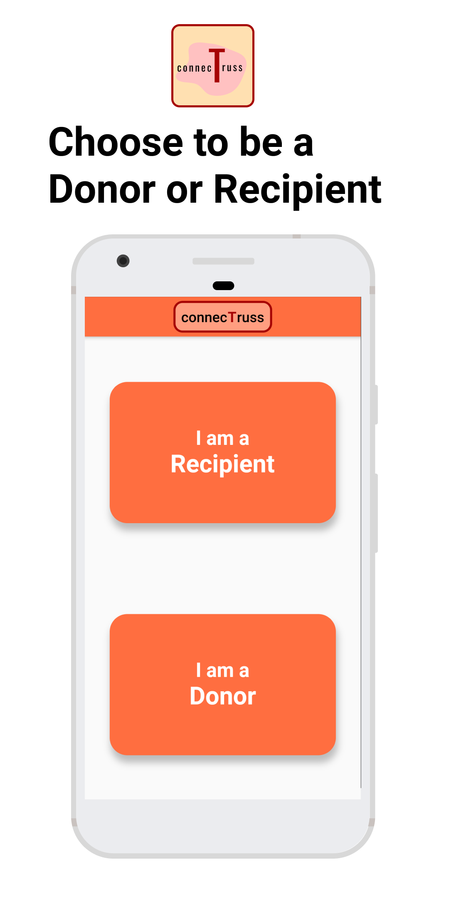
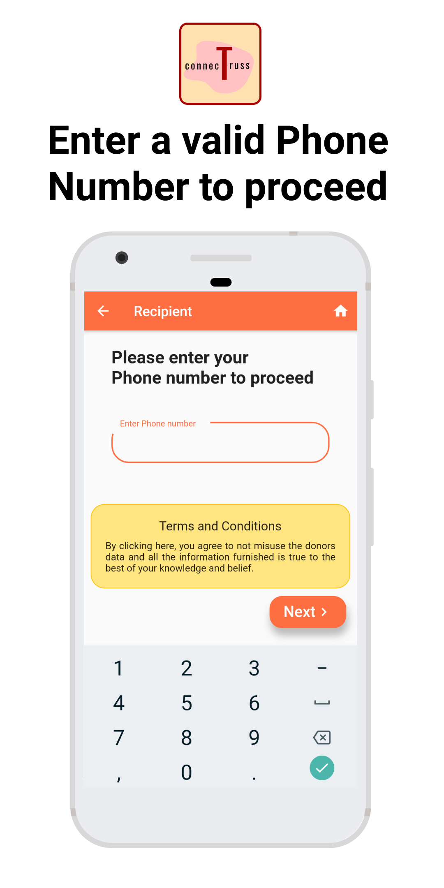
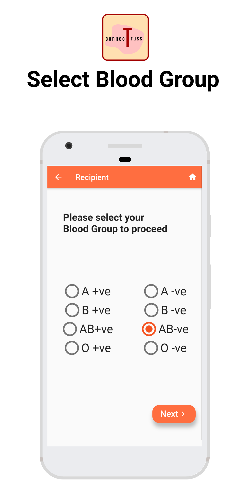
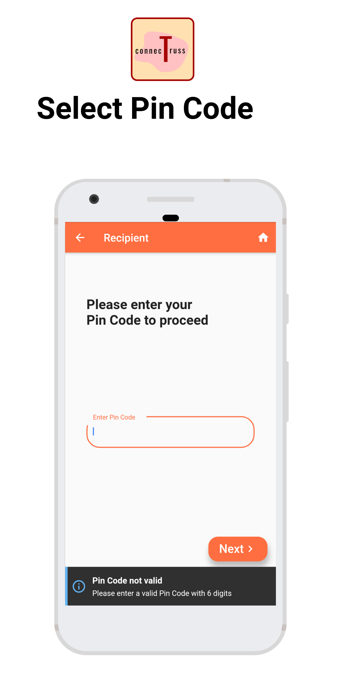
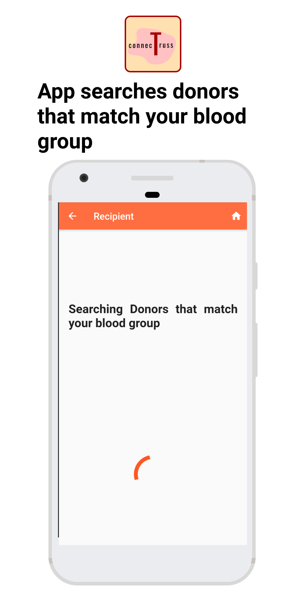
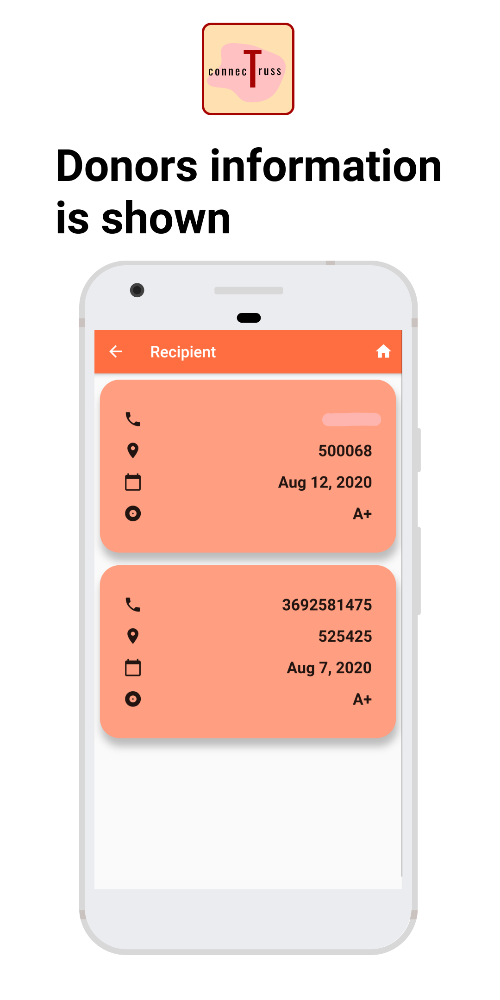
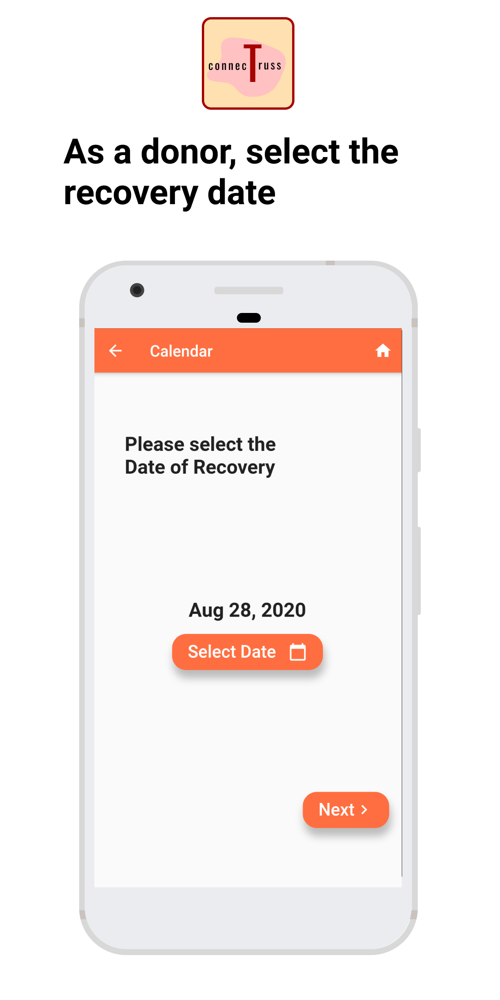
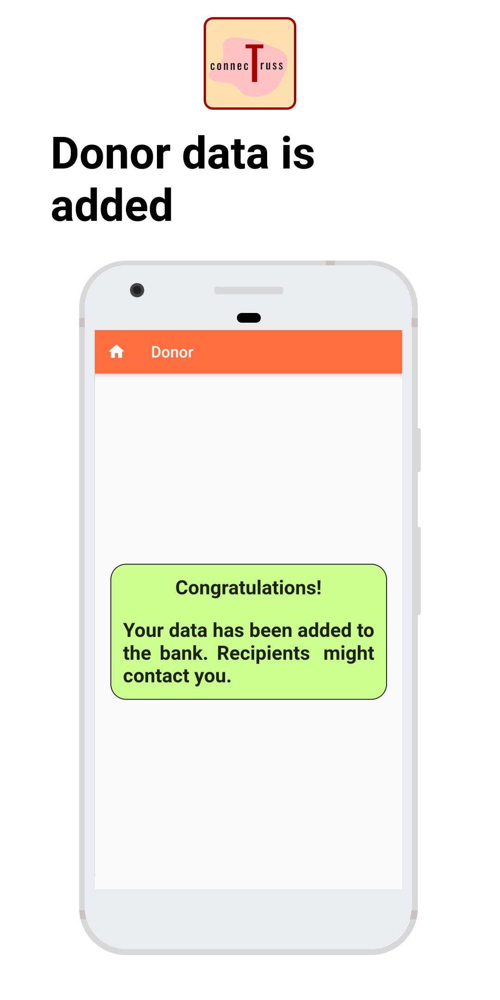

## connecTruss

##### Introduction

*connec**T**russ* is an application aimed at providing a support framework in connecting individuals. 

This helps donors to connect with recipients at ease. 

This app is pedning publication and will publish at https://play.google.com/store/apps/details?id=com.saiankit.connectruss

------

#### Salient Features of connecTruss

 ###### Video Version : https://youtu.be/tSElpCUb_As


###### Photographic Version :

|  |  |  |  |
| ----------------------------------------------------- | ----------------------------------------------------- | ----------------------------------------------------- | ----------------------------------------------------- |
|  |  |  |  |

------

#### How to use the app locally on your machine ?

<u>Requirements</u>

1. Flutter installed on your machine.
2. A simulator/emulator for running the application.

**Step #1** : Clone this repository using 

``` git clone https://github.com/saiankit/connectruss.git ```

**Step #2** : Run the following command in the directory

``` flutter packages get```

**Step #3**: Open a simulator / emulator and run the application

``` flutter run```